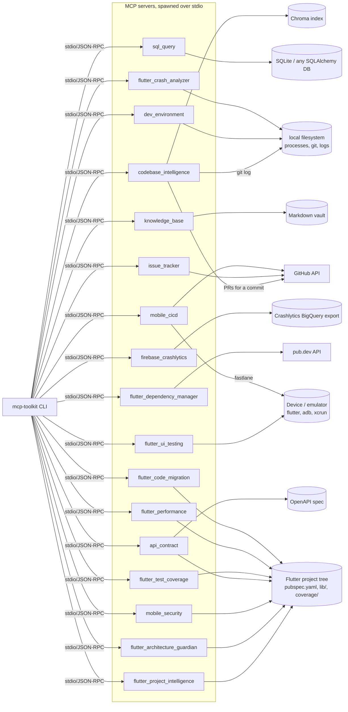

# mcp-toolkit-ai

Seventeen [MCP](https://modelcontextprotocol.io) servers — five general-purpose (semantic code
search, safe SQL querying, a GitHub Issues bridge, local dev-environment awareness, a personal
Markdown knowledge base) and twelve Flutter/mobile-focused (project intelligence, UI testing,
crash analysis, Crashlytics, architecture review, dependency management, mobile security, API
contract checking, test coverage, performance analysis, CI/CD, and code migration) — plus one
generic CLI client that speaks to all of them over the real protocol.

The twelve Flutter servers also live standalone at
[flutter-mcp-toolkit](https://github.com/rlphjyson/flutter-mcp-toolkit) for anyone who only
wants the Flutter/mobile set.

## What makes this one different

Each server is a small, independently-installable Python package exposing MCP
tools/resources over stdio; the CLI is a thin, generic client, not a bespoke UI per server. That
keeps every server's scope tight (no UI layer to also build five times) and demonstrates a
different kind of integration surface than the rest of the series: the thing consuming these
servers is meant to be an AI agent (Claude Code, Claude Desktop, or this repo's own CLI), not a
browser.

## Servers

| Server | Package | What it does |
| --- | --- | --- |
| **Codebase Intelligence** | `codebase_intelligence` | Semantic search over an indexed git repo (local sentence-transformers embeddings + Chroma), file commit history, and pull requests that touched a file (via the GitHub API) |
| **Safe SQL Query** | `sql_query` | Schema introspection and read-only SQL querying — `sqlparse`-validated single-`SELECT`-only, row-capped, timeout-enforced |
| **Issue Tracker** | `issue_tracker` | GitHub Issues bridge — list, search, read, create, and comment on issues |
| **Dev Environment** | `dev_environment` | Local process listing, recent git commits, running a repo's test command, tailing a log file (allowlisted directory only) |
| **Knowledge Base** | `knowledge_base` | Search/create Markdown notes in a local vault, with `[[wikilink]]`-based backlinks |

### Flutter / mobile servers

| Server | Package | What it does |
| --- | --- | --- |
| **Flutter Project Intelligence** | `flutter_project_intelligence` | Indexes a Flutter project's widgets, BLoC/Cubit/Riverpod state, GoRouter/named routes, repositories/use cases, API clients, and its own import graph |
| **Flutter UI Testing** | `flutter_ui_testing` | Lists connected devices, launches an app, taps/enters text/scrolls, takes screenshots, and runs `integration_test` files |
| **Flutter Crash & Log Analyzer** | `flutter_crash_analyzer` | Parses Flutter/Dart stack traces, tags likely root causes, and attaches `git blame` for the offending line |
| **Firebase / Crashlytics** | `firebase_crashlytics` | Queries Crashlytics' BigQuery export for top issues, trends, and affected versions |
| **Flutter Architecture Guardian** | `flutter_architecture_guardian` | Flags Clean Architecture / feature-first layering violations via the project's import graph |
| **Flutter Dependency Manager** | `flutter_dependency_manager` | Checks `pubspec.yaml` dependencies against pub.dev for outdated/discontinued packages, plus unused-import detection |
| **Mobile Security** | `mobile_security` | Static scan for hardcoded secrets, insecure `http://` endpoints, unsafe local storage, and risky Android/iOS config |
| **API Contract** | `api_contract` | Compares an OpenAPI spec's schemas/endpoints against Flutter Dart models and API client call sites |
| **Flutter Test Coverage** | `flutter_test_coverage` | Parses `coverage/lcov.info` for low-coverage files, uncovered lines, and source files with no matching test |
| **Flutter Performance** | `flutter_performance` | Analyzes DevTools timeline exports for jank/frame times and `--analyze-size` reports for app-size bloat |
| **Mobile CI/CD** | `mobile_cicd` | Inspects/triggers GitHub Actions runs and runs local Fastlane lanes (the practical path to TestFlight/Play/Firebase App Distribution) |
| **Flutter Code Migration** | `flutter_code_migration` | Scans for legacy patterns (deprecated widgets, Navigator, BLoC) and mechanically applies the subset of renames that are safe to automate |

Each server ships its own `pyproject.toml` and dependency set (only `codebase_intelligence`
needs `sentence-transformers`/`chromadb`, only `sql_query` needs `sqlalchemy`, etc.) — the same
shape a real standalone MCP server would take, not one monolith with everything installed.

### A note on scope for three of the Flutter servers

- **Firebase / Crashlytics** has no public per-crash REST API. The real-world way to query it
  programmatically is via its BigQuery export, so that's what this server does — no
  `google-cloud-bigquery` SDK dependency, just `httpx` against BigQuery's REST API with a bearer
  token from `FIREBASE_BIGQUERY_ACCESS_TOKEN` (e.g. `gcloud auth print-access-token`).
- **Mobile CI/CD** scopes to GitHub Actions (reusing this repo's `GITHUB_TOKEN` pattern) and
  locally-installed Fastlane, rather than reimplementing the App Store Connect and Google Play
  Developer APIs directly — Fastlane is itself the standard way a Flutter project already talks
  to TestFlight, Play Console, and Firebase App Distribution.
- **Flutter Code Migration** only auto-applies renames that are genuine 1:1 mechanical
  transformations (e.g. `RaisedButton` → `ElevatedButton`). Navigator → GoRouter and BLoC →
  Riverpod migrations are detection-and-guidance only — those need semantic understanding a
  regex can't safely provide, so `apply_transformation` refuses to touch them.

## Architecture



The CLI reads [`servers.toml`](servers.toml) at the repo root — a registry of short names to
launch commands — and spawns the chosen server as a subprocess per `stdio_client`, the standard
local-MCP pattern. One generic client works with all five servers because they all speak the
same protocol.

## Tech stack

- **MCP Python SDK** `mcp>=2.1` (`MCPServer`, not the older `FastMCP` name)
- **sentence-transformers + Chroma** for local, no-API-key semantic search
- **SQLAlchemy + sqlparse** for the SQL server's schema access and query-safety validation
- **httpx** for the GitHub-, pub.dev-, and BigQuery-backed servers
- **psutil** for process listing
- **PyYAML** for `pubspec.yaml`/OpenAPI parsing
- **Typer + Rich** for the CLI
- Everything else Flutter-specific (Dart source scanning, lcov parsing, DevTools timeline
  analysis, `AndroidManifest.xml`/`Info.plist` parsing) is regex/stdlib-based by design — no
  Flutter SDK or Dart analyzer is required to run these servers' tests

## Getting started

Each server and the CLI are independent installable packages. For local dev, install everything
into one shared virtualenv:

```bash
python -m venv .venv
source .venv/bin/activate  # or .venv\Scripts\activate on Windows

pip install -e "servers/codebase_intelligence[dev]"
pip install -e "servers/sql_query[dev]"
pip install -e "servers/issue_tracker[dev]"
pip install -e "servers/dev_environment[dev]"
pip install -e "servers/knowledge_base[dev]"
pip install -e "servers/flutter_project_intelligence[dev]"
pip install -e "servers/flutter_ui_testing[dev]"
pip install -e "servers/flutter_crash_analyzer[dev]"
pip install -e "servers/firebase_crashlytics[dev]"
pip install -e "servers/flutter_architecture_guardian[dev]"
pip install -e "servers/flutter_dependency_manager[dev]"
pip install -e "servers/mobile_security[dev]"
pip install -e "servers/api_contract[dev]"
pip install -e "servers/flutter_test_coverage[dev]"
pip install -e "servers/flutter_performance[dev]"
pip install -e "servers/mobile_cicd[dev]"
pip install -e "servers/flutter_code_migration[dev]"
pip install -e "cli[dev]"
```

`servers.toml` maps short names to launch commands; `command = "python"` means "whichever
interpreter the CLI itself is running under," so no PATH configuration is needed. Servers that
need credentials (`issue_tracker`'s and `mobile_cicd`'s `GITHUB_TOKEN`, `firebase_crashlytics`'s
`FIREBASE_BIGQUERY_ACCESS_TOKEN`/`FIREBASE_BIGQUERY_PROJECT`) read them via `${VAR_NAME}`
expansion against your own shell environment — the credential itself never lives in the file.

```bash
mcp-toolkit list-servers
mcp-toolkit list-tools codebase
mcp-toolkit call-tool codebase index_repository --args '{"repo_path": "."}'
```

## Example transcripts

**Codebase Intelligence** — index this repo and search it semantically:

```
$ mcp-toolkit call-tool codebase index_repository --args '{"repo_path": "."}'
{"repo_id": "3f9a2c1e8b7d", "indexed_files": 16, "chunks": 41}

$ mcp-toolkit call-tool codebase search_code --args '{"repo_id": "3f9a2c1e8b7d", "query": "find pull requests related to a file", "top_k": 1}'
[{"file": "codebase_intelligence/related_prs.py", "chunk_index": 0, "text": "...", "distance": 0.31}]
```

**Safe SQL Query** — schema introspection and a rejected non-SELECT statement:

```
$ mcp-toolkit call-tool sql run_query --args '{"sql": "DELETE FROM items"}'
Error executing tool run_query: Only SELECT statements are allowed (got DELETE).
```

**Issue Tracker** — unauthenticated read against a real public repo:

```
$ mcp-toolkit call-tool issues list_issues --args '{"repo": "octocat/Hello-World", "state": "open"}'
[{"number": 11019, "title": "Test issue from API tool", "state": "open", "labels": [], "url": "..."}, ...]
```

**Dev Environment** — recent commit history for a real local repo:

```
$ mcp-toolkit call-tool devenv get_recent_git_commits --args '{"repo_path": "../docuchat-ai", "limit": 1}'
[{"sha": "1dfdc899...", "author": "rlphjyson", "date": "2026-08-27T03:43:52+08:00", "message": "Update README.md"}]
```

**Knowledge Base** — create a note that links to an existing one, then find the backlink:

```
$ mcp-toolkit call-tool kb create_note --args '{"title": "Cherries", "content": "See [[Apples]]."}'
{"path": "cherries.md", "title": "Cherries"}

$ mcp-toolkit call-tool kb get_backlinks --args '{"path": "apples.md"}'
[{"path": "cherries.md", "title": "Cherries"}]
```

## A deliberate MCP security default worth knowing

By default, an MCP server subprocess does **not** inherit its parent's full environment — only a
small, fixed allowlist (`PATH`, `HOME`, etc.). Anything else, like `issue_tracker`'s
`GITHUB_TOKEN`, only reaches the server if it's explicitly declared in `servers.toml`'s `env`
block. This is the SDK's own choice, not something this repo added — worth knowing before
assuming a variable in your shell will silently show up inside a spawned server.

## Testing

- Every tool function is a plain Python function under a decorator — unit-testable directly, no
  MCP transport needed for most tests.
- External dependencies (GitHub, a DB, the filesystem) sit behind small seams — dependency
  injection (`httpx.MockTransport`), env-var-gated fakes, or fixtures on `tmp_path` — so tests
  don't hit real networks or need real infrastructure.
- At least one true end-to-end test per server spawns the real server subprocess via
  `stdio_client` + `ClientSession` and calls a tool through the actual protocol — including a
  regression test per server confirming that a deliberately-raised, safe error message reaches
  the client rather than the MCP SDK's default generic "Error executing tool X" (the SDK redacts
  any exception that isn't its own `ToolError`/`ResourceError`; every server here wraps its tools
  to convert known-safe exceptions accordingly).

```bash
cd servers/codebase_intelligence && ruff check . && mypy codebase_intelligence && pytest -q
# ...same for every other server (see servers.toml for the full list) and the cli
```

CI runs this matrix (ruff + mypy + pytest) across all seventeen servers and the CLI on every push.

## License

[MIT](LICENSE)
