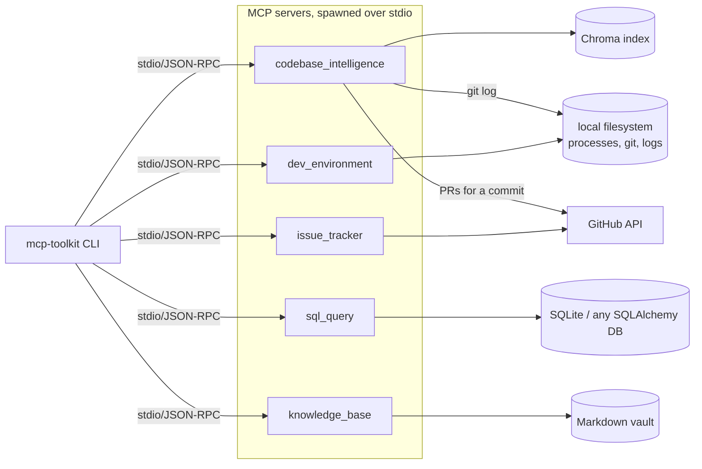

# mcp-toolkit-ai

Five [MCP](https://modelcontextprotocol.io) servers — semantic code search, safe SQL querying,
a GitHub Issues bridge, local dev-environment awareness, and a personal Markdown knowledge
base — plus one generic CLI client that speaks to all five over the real protocol.

Project 3 of a 2026 portfolio series — see [project 1, docuchat-ai](https://github.com/rlphjyson/docuchat-ai)
(RAG chat) and [project 2, prreview-ai](https://github.com/rlphjyson/prreview-ai) (AI PR review).

## What makes this one different

Projects 1 and 2 are fullstack web apps. This one is deliberately protocol-only — no frontend,
no dashboard. Each server is a small, independently-installable Python package exposing MCP
tools/resources over stdio; the CLI is a thin, generic client, not a bespoke UI per server. That
keeps every server's scope tight (no UI layer to also build five times) and demonstrates a
different kind of integration surface than the rest of the series: the thing consuming these
servers is meant to be an AI agent (Claude Code, Claude Desktop, or this repo's own CLI), not a
browser.

## Servers

| Server | Package | What it does |
| --- | --- | --- |
| **Codebase Intelligence** | `codebase_intelligence` | Semantic search over an indexed git repo (local sentence-transformers embeddings + Chroma), file commit history, and pull requests that touched a file (via the GitHub API) |
| **Safe SQL Query** | `sql_query` | Schema introspection and read-only SQL querying — `sqlparse`-validated single-`SELECT`-only, row-capped, timeout-enforced |
| **Issue Tracker** | `issue_tracker` | GitHub Issues bridge — list, search, read, create, and comment on issues |
| **Dev Environment** | `dev_environment` | Local process listing, recent git commits, running a repo's test command, tailing a log file (allowlisted directory only) |
| **Knowledge Base** | `knowledge_base` | Search/create Markdown notes in a local vault, with `[[wikilink]]`-based backlinks |

Each server ships its own `pyproject.toml` and dependency set (only `codebase_intelligence`
needs `sentence-transformers`/`chromadb`, only `sql_query` needs `sqlalchemy`, etc.) — the same
shape a real standalone MCP server would take, not one monolith with everything installed.

## Architecture



The CLI reads [`servers.toml`](servers.toml) at the repo root — a registry of short names to
launch commands — and spawns the chosen server as a subprocess per `stdio_client`, the standard
local-MCP pattern. One generic client works with all five servers because they all speak the
same protocol.

## Tech stack

- **MCP Python SDK** `mcp>=2.1` (`MCPServer`, not the older `FastMCP` name)
- **sentence-transformers + Chroma** for local, no-API-key semantic search
- **SQLAlchemy + sqlparse** for the SQL server's schema access and query-safety validation
- **httpx** for the GitHub-backed servers
- **psutil** for process listing
- **Typer + Rich** for the CLI

## Getting started

Each server and the CLI are independent installable packages. For local dev, install everything
into one shared virtualenv:

```bash
python -m venv .venv
source .venv/bin/activate  # or .venv\Scripts\activate on Windows

pip install -e "servers/codebase_intelligence[dev]"
pip install -e "servers/sql_query[dev]"
pip install -e "servers/issue_tracker[dev]"
pip install -e "servers/dev_environment[dev]"
pip install -e "servers/knowledge_base[dev]"
pip install -e "cli[dev]"
```

`servers.toml` maps short names to launch commands; `command = "python"` means "whichever
interpreter the CLI itself is running under," so no PATH configuration is needed. Servers that
need credentials (`issue_tracker`'s `GITHUB_TOKEN`) read them via `${VAR_NAME}` expansion against
your own shell environment — the token itself never lives in the file.

```bash
mcp-toolkit list-servers
mcp-toolkit list-tools codebase
mcp-toolkit call-tool codebase index_repository --args '{"repo_path": "."}'
```

## Example transcripts

**Codebase Intelligence** — index this repo and search it semantically:

```
$ mcp-toolkit call-tool codebase index_repository --args '{"repo_path": "."}'
{"repo_id": "3f9a2c1e8b7d", "indexed_files": 16, "chunks": 41}

$ mcp-toolkit call-tool codebase search_code --args '{"repo_id": "3f9a2c1e8b7d", "query": "find pull requests related to a file", "top_k": 1}'
[{"file": "codebase_intelligence/related_prs.py", "chunk_index": 0, "text": "...", "distance": 0.31}]
```

**Safe SQL Query** — schema introspection and a rejected non-SELECT statement:

```
$ mcp-toolkit call-tool sql run_query --args '{"sql": "DELETE FROM items"}'
Error executing tool run_query: Only SELECT statements are allowed (got DELETE).
```

**Issue Tracker** — unauthenticated read against a real public repo:

```
$ mcp-toolkit call-tool issues list_issues --args '{"repo": "octocat/Hello-World", "state": "open"}'
[{"number": 11019, "title": "Test issue from API tool", "state": "open", "labels": [], "url": "..."}, ...]
```

**Dev Environment** — recent commit history for a real local repo:

```
$ mcp-toolkit call-tool devenv get_recent_git_commits --args '{"repo_path": "../docuchat-ai", "limit": 1}'
[{"sha": "1dfdc899...", "author": "rlphjyson", "date": "2026-08-27T03:43:52+08:00", "message": "Update README.md"}]
```

**Knowledge Base** — create a note that links to an existing one, then find the backlink:

```
$ mcp-toolkit call-tool kb create_note --args '{"title": "Cherries", "content": "See [[Apples]]."}'
{"path": "cherries.md", "title": "Cherries"}

$ mcp-toolkit call-tool kb get_backlinks --args '{"path": "apples.md"}'
[{"path": "cherries.md", "title": "Cherries"}]
```

## A deliberate MCP security default worth knowing

By default, an MCP server subprocess does **not** inherit its parent's full environment — only a
small, fixed allowlist (`PATH`, `HOME`, etc.). Anything else, like `issue_tracker`'s
`GITHUB_TOKEN`, only reaches the server if it's explicitly declared in `servers.toml`'s `env`
block. This is the SDK's own choice, not something this repo added — worth knowing before
assuming a variable in your shell will silently show up inside a spawned server.

## Testing

- Every tool function is a plain Python function under a decorator — unit-testable directly, no
  MCP transport needed for most tests.
- External dependencies (GitHub, a DB, the filesystem) sit behind small seams — dependency
  injection (`httpx.MockTransport`), env-var-gated fakes, or fixtures on `tmp_path` — so tests
  don't hit real networks or need real infrastructure.
- At least one true end-to-end test per server spawns the real server subprocess via
  `stdio_client` + `ClientSession` and calls a tool through the actual protocol — including a
  regression test per server confirming that a deliberately-raised, safe error message reaches
  the client rather than the MCP SDK's default generic "Error executing tool X" (the SDK redacts
  any exception that isn't its own `ToolError`/`ResourceError`; every server here wraps its tools
  to convert known-safe exceptions accordingly).

```bash
cd servers/codebase_intelligence && ruff check . && mypy codebase_intelligence && pytest -q
# ...same for sql_query, issue_tracker, dev_environment, knowledge_base, and cli
```

CI runs this matrix (ruff + mypy + pytest) across all five servers and the CLI on every push.

## License

[MIT](LICENSE)
